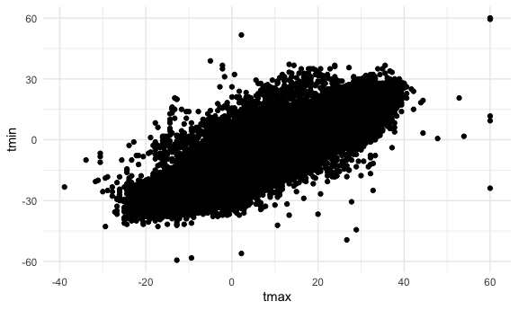
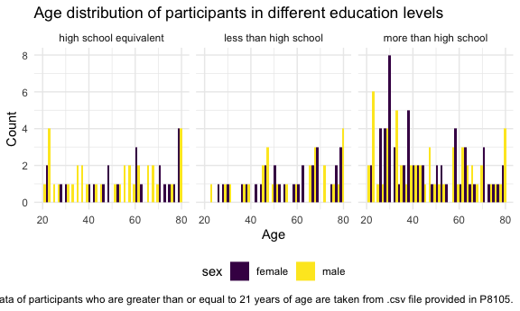

p8105_hw3_sy3269
================
Soomin You

# Problem 1

The packages required for this homework (e.g. `tidyverse` and
`lubridate`) were loaded.

``` r
library(p8105.datasets)
data("ny_noaa") 

clean_ny_noaa = 
  ny_noaa |> 
  mutate(
    tmax = as.integer(tmax), 
    tmin = as.integer(tmin), 
    tmax = tmax/10, 
    tmin = tmin/10, 
    prcp = prcp/10, 
    day = floor_date(date, unit = "day"),
    month = floor_date(date, unit = "month"), 
    year = floor_date(date, unit = "year")
  ) |>
  arrange(year, month, day) 

clean_ny_noaa |>
  group_by(id) |>
  summarize(n_obs_per_id = n())
```

    ## # A tibble: 747 × 2
    ##    id          n_obs_per_id
    ##    <chr>              <int>
    ##  1 US1NYAB0001         1157
    ##  2 US1NYAB0006          852
    ##  3 US1NYAB0010          822
    ##  4 US1NYAB0016          214
    ##  5 US1NYAB0017          459
    ##  6 US1NYAB0021          365
    ##  7 US1NYAB0022          273
    ##  8 US1NYAB0023          365
    ##  9 US1NYAB0025          215
    ## 10 US1NYAL0002          549
    ## # ℹ 737 more rows

``` r
clean_ny_noaa |>
  group_by(year) |>
  summarize(n_obs_per_yr = n())
```

    ## # A tibble: 30 × 2
    ##    year       n_obs_per_yr
    ##    <date>            <int>
    ##  1 1981-01-01        85551
    ##  2 1982-01-01        82939
    ##  3 1983-01-01        81535
    ##  4 1984-01-01        82351
    ##  5 1985-01-01        80902
    ##  6 1986-01-01        82184
    ##  7 1987-01-01        80354
    ##  8 1988-01-01        80271
    ##  9 1989-01-01        81344
    ## 10 1990-01-01        81905
    ## # ℹ 20 more rows

The NY NOAA data was imported first. Then, the data was cleaned and
studied.

There are total of 2595176 observations from 747 different locations,
ranging from year 1981 to 2020, in this data set.

There were originally 7 different variables as follows: `id` that
corresponds to the location, `date` that shows when the observation data
was collected, `snow` for snowfall amount, `snwd` for snow depth, `tmax`
for maximum temperature and `tmin` for minimum temperature. Three
additional variables for `year`, `month`, and `date` were added as a
part of cleaning.

It was observed that the number of available observations differ
depending on the id. For instance, there are 1157 observations for id
`US1NYAB0001`, whereas there are only 214 observations available for id
`US1NYAB0016`. Also, depending on the year, the total number of
observations differ. It can be seen that there are a lot missing data in
this data set.

In addition, the variable units for the given data was checked. To
ensure that all data for precipitation, snowfall and snow depth are
given in consistent unit of mm, `prcp` values given in tenths of mm were
adjusted. Similarly, to ensure the temperature values are given in
Celsius, both the `tmax` and `tmin` values, which were given in tenths
of Celsius, were adjusted.

The variable types for `tmax` and `tmin` were also changed to integer as
they were originally defined as characters.

``` r
clean_ny_noaa |>
  drop_na() |>
  count(snow) |>
  filter(n == max(n)) |>
  pull(snow)
```

    ## [1] 0

The most commonly observed value is 0 for snowfall. It probably means
that there are more days that did not snow at all throughout the years,
which sounds reasonable considering that there are four different
seasons in New York.

A two-panel plot showing the average maximum temperature in January and
in July in each station across the years is shown above. The average
maximum temperatures in July seem to be more consistent over the time
compared to the average maximum temperatures in January. There are only
few outliers that fall below the over distribution in July whereas there
are several outliers in both upper and lower area over the distribution
in January plot.

## Is there any observable / interpretable structure? Any outliers?

``` r
clean_ny_noaa |>
  group_by(tmax, tmin, id, year, month) |>
  summarize() |>
  drop_na() |>
  ggplot(aes(x = tmax, y = tmin, )) + 
  geom_point()
```

    ## `summarise()` has grouped output by 'tmax', 'tmin', 'id', 'year'. You can
    ## override using the `.groups` argument.



Make a two-panel plot showing (i) tmax vs tmin for the full dataset
(note that a scatterplot may not be the best option); and (ii) make a
plot showing the distribution of snowfall values greater than 0 and less
than 100 separately by year.

# Problem 2

``` r
nhanes_accel_df = 
  read_csv("./nhanes_accel.csv", na = c("NA", ",", "")) |>
  janitor::clean_names()
```

    ## Rows: 250 Columns: 1441
    ## ── Column specification ────────────────────────────────────────────────────────
    ## Delimiter: ","
    ## dbl (1441): SEQN, min1, min2, min3, min4, min5, min6, min7, min8, min9, min1...
    ## 
    ## ℹ Use `spec()` to retrieve the full column specification for this data.
    ## ℹ Specify the column types or set `show_col_types = FALSE` to quiet this message.

``` r
nhanes_demo_df = 
  read_csv("./nhanes_covar.csv", na = c("NA", ".", ""), skip = 4) |>
  janitor::clean_names() |> 
  mutate(
    sex = case_match(
      sex, 
      1 ~ "male", 
      2 ~ "female"), 
    sex = factor(sex),
    education = case_match(
      education, 
      1 ~ "less than high school", 
      2 ~ "high school equivalent", 
      3 ~ "more than high school"),
    education = factor(education)
    ) 
```

    ## Rows: 250 Columns: 5
    ## ── Column specification ────────────────────────────────────────────────────────
    ## Delimiter: ","
    ## dbl (5): SEQN, sex, age, BMI, education
    ## 
    ## ℹ Use `spec()` to retrieve the full column specification for this data.
    ## ℹ Specify the column types or set `show_col_types = FALSE` to quiet this message.

``` r
nhanes_data_df = 
  left_join(nhanes_demo_df, nhanes_accel_df, by = "seqn") |>
  drop_na() |>
  filter(age >= 21) 
```

An accelerometer data collected in the NHANES study was loaded and
cleaned. Demographic data of the participants in the NHANES study was
also loaded and cleaned.

Some of the variables in the demographic data were changed to more
self-explanatory values and their types were changed to factor. For
instance, values for `sex` variable was changed from 1 and 2 to male and
female.

In addition, the two data sets were merged into one data frame and
participants who did not have full demographic data were excluded. Also,
only the participants who were 21 years or older were included in the
merged data set.

``` r
nhanes_data_df |>
  group_by(education, sex) |>
  janitor::tabyl(education, sex) |>
  knitr::kable()
```

| education              | female | male |
|:-----------------------|-------:|-----:|
| high school equivalent |     23 |   35 |
| less than high school  |     28 |   27 |
| more than high school  |     59 |   56 |

A reader-friendly table for the number of men and women in each
education category was made.

``` r
nhanes_data_df |>
  pivot_longer(
    cols = min1:min1440,
    names_to = "minute",
    values_to = "mims",
    names_prefix = "min"
  ) |>
  group_by(seqn, sex, age, education) |>
  summarize(total_activity = sum(mims, na.rm = TRUE)) |>
  ggplot(aes(x = age, fill = sex)) +
  geom_histogram(position = "dodge") + 
  facet_grid(. ~ education) +
  labs(
    title = "Age distribution of participants in different education levels",
    x = "Age",
    y = "Count",
    caption = "NHANES data of participants who are greater than or equal to 21 years of age are taken from .csv file provided in P8105."
  )
```

    ## `summarise()` has grouped output by 'seqn', 'sex', 'age'. You can override
    ## using the `.groups` argument.
    ## `stat_bin()` using `bins = 30`. Pick better value with `binwidth`.



Prior to creating a graph, the data was reformatted using
`pivot_longer`. Then, `group_by` and `summarize` function was used to
calculate the total_activity that sums up the accelerometer data
measured every minute throughout the day. A visualization of the age
distributions for men and women in each education category was created.

For education level ‘more than high school,’ there are more of the
younger participants who are under 40 than the older participants. There
are four age groups with more than 4 participants under 40 whereas there
are only two age groups with 4 for participants above 40.

For ‘less than high school’ level, there are greater number of
participants who are over 40.

For ‘high school equivalent’ level, there

``` r
nhanes_data_df |>
  pivot_longer(
    cols = min1:min1440,
    names_to = "minute",
    values_to = "mims",
    names_prefix = "min"
  ) |>
  group_by(seqn, sex, age, education) |>
  summarize(total_activity = sum(mims, na.rm = TRUE)) |>
  ggplot(aes(x = age, y = total_activity, color = sex)) + 
  geom_point() +
  geom_smooth(se = FALSE) + 
  facet_grid(. ~ education) +
  labs(
    title = "Accelerometer data over 24-hour of participants in different education levels",
    x = "Age",
    y = "Total activity",
    caption = "NHANES data of participants who are greater than or equal to 21 years of age are taken from .csv file provided in P8105."
  )
```

    ## `summarise()` has grouped output by 'seqn', 'sex', 'age'. You can override
    ## using the `.groups` argument.
    ## `geom_smooth()` using method = 'loess' and formula = 'y ~ x'


Overall, the younger the participants are, the higher the total activity
is for both female and male regardless of the education level. The
regression line for both males and females in all three different
education levels have similar tendencies. However, in ‘high school
equivalent’ group, there is a female participant around 30 who has a
relatively low total-activity observation compared to females in her age
and another female participant around the same age with a notably high
observation.

It can be also seen that in ‘high school equivalent’ and ‘more than high
school’ groups, females tend to have higher total activity than males in
all age groups. However, for ‘less than high school’ group, only female
participants who are younger than 40 have higher total activity than
males; for participants over 40, higher total activity observations can
be found in males according to the regression line added with
`geom_smooth`.

# Problem 3

``` r
bike_jan_2020 = 
  read_csv("./citibike/Jan 2020 Citi.csv", na = c("NA", ".", "")) |>
  janitor::clean_names()
```

    ## Rows: 12420 Columns: 7
    ## ── Column specification ────────────────────────────────────────────────────────
    ## Delimiter: ","
    ## chr (6): ride_id, rideable_type, weekdays, start_station_name, end_station_n...
    ## dbl (1): duration
    ## 
    ## ℹ Use `spec()` to retrieve the full column specification for this data.
    ## ℹ Specify the column types or set `show_col_types = FALSE` to quiet this message.

``` r
bike_jan_2024 = 
  read_csv("./citibike/Jan 2024 Citi.csv", na = c("NA", ".", "")) |>
  janitor::clean_names()
```

    ## Rows: 18861 Columns: 7
    ## ── Column specification ────────────────────────────────────────────────────────
    ## Delimiter: ","
    ## chr (6): ride_id, rideable_type, weekdays, start_station_name, end_station_n...
    ## dbl (1): duration
    ## 
    ## ℹ Use `spec()` to retrieve the full column specification for this data.
    ## ℹ Specify the column types or set `show_col_types = FALSE` to quiet this message.

``` r
bike_jul_2020 = 
  read_csv("./citibike/July 2020 Citi.csv", na = c("NA", ".", "")) |>
  janitor::clean_names() 
```

    ## Rows: 21048 Columns: 7
    ## ── Column specification ────────────────────────────────────────────────────────
    ## Delimiter: ","
    ## chr (6): ride_id, rideable_type, weekdays, start_station_name, end_station_n...
    ## dbl (1): duration
    ## 
    ## ℹ Use `spec()` to retrieve the full column specification for this data.
    ## ℹ Specify the column types or set `show_col_types = FALSE` to quiet this message.

``` r
bike_jul_2024 = 
  read_csv("./citibike/July 2024 Citi.csv", na = c("NA", ".", "")) |>
  janitor::clean_names() 
```

    ## Rows: 47156 Columns: 7
    ## ── Column specification ────────────────────────────────────────────────────────
    ## Delimiter: ","
    ## chr (6): ride_id, rideable_type, weekdays, start_station_name, end_station_n...
    ## dbl (1): duration
    ## 
    ## ℹ Use `spec()` to retrieve the full column specification for this data.
    ## ℹ Specify the column types or set `show_col_types = FALSE` to quiet this message.

NYC Citi Bike data provided was imported and cleaned.

``` r
bike_jan_2020 |>
  group_by(member_casual) |>
  summarize(n_obs = n()) |>
  knitr::kable()
```

| member_casual | n_obs |
|:--------------|------:|
| casual        |   984 |
| member        | 11436 |

A reader friendly table showing the total number of rides separating
casual riders and Citi Bike members is made for January 2020 data. There
were 984 casual rides and 11436 member rides.

``` r
bike_jan_2024 |>
  group_by(member_casual) |>
  summarize(n_obs = n()) |>
  knitr::kable()
```

| member_casual | n_obs |
|:--------------|------:|
| casual        |  2108 |
| member        | 16753 |

A reader friendly table showing the total number of rides separating
casual riders and Citi Bike members is made for January 2024 data. There
were 2108 casual rides and 16753 member rides.

``` r
bike_jul_2020 |>
  group_by(member_casual) |>
  summarize(n_obs = n()) |>
  knitr::kable()
```

| member_casual | n_obs |
|:--------------|------:|
| casual        |  5637 |
| member        | 15411 |

A reader friendly table showing the total number of rides separating
casual riders and Citi Bike members is made for July 2020 data. There
were 5637 casual rides and 15411 member rides.

``` r
bike_jul_2024 |> 
  group_by(member_casual) |>
  summarize(n_obs = n()) |>
  knitr::kable()
```

| member_casual | n_obs |
|:--------------|------:|
| casual        | 10894 |
| member        | 36262 |

A reader friendly table showing the total number of rides separating
casual riders and Citi Bike members is made for July 2020 data. There
were 10894 casual rides and 36262 member rides.

In all four combination of year and month, there were notably more
member rides than casual rides.

``` r
bike_jul_2024 |>
  count(start_station_name) |>
  arrange(desc(n)) |>
  slice(1:5) |>
  knitr::kable()
```

| start_station_name       |   n |
|:-------------------------|----:|
| Pier 61 at Chelsea Piers | 163 |
| University Pl & E 14 St  | 155 |
| W 21 St & 6 Ave          | 152 |
| West St & Chambers St    | 150 |
| W 31 St & 7 Ave          | 146 |

A table showing the 5 most popular starting stations for July 2024 with
the number of rides originating from these stations is made. The most
popular starting station is Pier 61 at Chelsea Piers.

``` r
bike_jan_2020 = mutate(bike_jan_2020, year = 2020, month = "jan") 
bike_jan_2024 = mutate(bike_jan_2024, year = 2024, month = "jan")
bike_jan = bind_rows(bike_jan_2020, bike_jan_2024)

bike_jan_plot = 
  bike_jan |>
  group_by(weekdays, year) |>
  summarize(median_duration = median(duration)) |> 
  mutate(
    weekdays = 
      factor(weekdays, levels = c("Monday", "Tuesday", "Wednesday", "Thursday", "Friday", "Saturday", "Sunday"))) |>
  ggplot(aes(x = weekdays, y = median_duration, fill = factor(year))) +
  geom_bar(stat = "identity", position = position_dodge()) +
  ylim(0, 18) + 
  labs(
    x = "Weekdays",
    y = "Median duration of ride",
    title = "Duration of Citibike rides in January",
    fill = "Year",
    caption = "Citibike January data of 2020 and 2024 provided by P8105 was used."
  ) 
```

    ## `summarise()` has grouped output by 'weekdays'. You can override using the
    ## `.groups` argument.

``` r
bike_jul_2020 = mutate(bike_jul_2020, year = 2020, month = "jul")
bike_jul_2024 = mutate(bike_jul_2024, year = 2024, month = "jul")
bike_jul = bind_rows(bike_jul_2020, bike_jul_2024)

bike_jul_plot = 
  bike_jul |>
  group_by(weekdays, year) |>
  summarize(median_duration = median(duration)) |> 
  mutate(
    weekdays = 
      factor(weekdays, levels = c("Monday", "Tuesday", "Wednesday", "Thursday", "Friday", "Saturday", "Sunday"))) |>
  ggplot(aes(x = weekdays, y = median_duration, fill = factor(year))) +
  geom_bar(stat = "identity", position = position_dodge()) +
  ylim(0, 18) + 
  labs(
    x = "Weekdays",
    y = "Median duration of ride",
    title = "Duration of Citibike rides in July",
    fill = "Year",
    caption = "Citibike July data of 2020 and 2024 provided by P8105 was used."
  )
```

    ## `summarise()` has grouped output by 'weekdays'. You can override using the
    ## `.groups` argument.

``` r
bike_jan_plot + bike_jul_plot 
```


A plot showing the median duration of ride for every weekday is shown
for month of January and July, comparing 2020 and 2024 data sets. It can
be seen that for both January and July, the overall median duration of
ride decreased in 2024, compared to 2020. The decrease in July is
notably big compared to the decrease in Janauary. This can be speculated
that…

Make a plot to investigate the effects of day of the week, month, and
year on median ride duration. This plot can include one or more panels,
but should facilitate comparison across all variables of interest.
Comment on your observations from this plot.

``` r
bike_2024 = bind_rows(bike_jan_2024, bike_jul_2024)

bike_2024_jan = 
  bike_2024 |>
  group_by(month, member_casual, rideable_type) |>
  summarize(median_duration = median(duration)) |>
  filter(month == "jan") |>
  ggplot(aes(x = member_casual, y = median_duration, fill = rideable_type)) + 
  geom_bar(stat = "identity", position = position_dodge()) +
  ylim(0, 18) + 
  labs(
    x = "Membership Type",
    y = "Median duration of ride",
    title = "Duration of Citibike rides in January 2024",
    fill = "Bike Type",
    caption = "2024 Citibike data provided by P8105 was used.") 
```

    ## `summarise()` has grouped output by 'month', 'member_casual'. You can override
    ## using the `.groups` argument.

``` r
bike_2024_jul = 
  bike_2024 |>
  group_by(month, member_casual, rideable_type) |>
  summarize(median_duration = median(duration)) |>
  filter(month == "jul") |>
  ggplot(aes(x = member_casual, y = median_duration, fill = rideable_type)) + 
  geom_bar(stat = "identity", position = position_dodge()) +
  ylim(0, 18) + 
  labs(
    x = "Membership Type",
    y = "Median duration of ride",
    title = "Duration of Citibike rides in July 2024",
    fill = "Bike Type",
    caption = "2024 Citibike data provided by P8105 was used.") 
```

    ## `summarise()` has grouped output by 'month', 'member_casual'. You can override
    ## using the `.groups` argument.

``` r
bike_2024_jan + bike_2024_jul
```


There were relatively few electric Citi Bikes in 2020, but many more are
available now. For data in 2024, make a figure that shows the impact of
month, membership status, and bike type on the distribution of ride
duration. Comment on your results.
