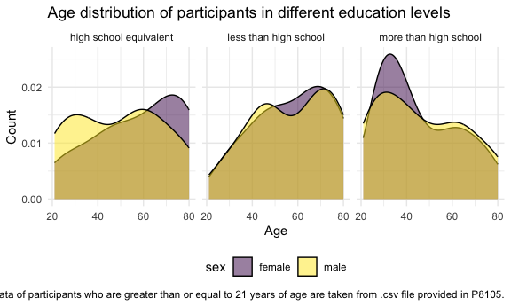

p8105_hw3_sy3269
================
Soomin You

# Problem 1

The packages required for this homework were loaded (e.g. `tidyverse`
and `lubridate`)

``` r
library(p8105.datasets)
data("ny_noaa") 

ny_noaa |>
  group_by(id) |>
  arrange(date) |>
  summarize(n_obs = n())
```

    ## # A tibble: 747 × 2
    ##    id          n_obs
    ##    <chr>       <int>
    ##  1 US1NYAB0001  1157
    ##  2 US1NYAB0006   852
    ##  3 US1NYAB0010   822
    ##  4 US1NYAB0016   214
    ##  5 US1NYAB0017   459
    ##  6 US1NYAB0021   365
    ##  7 US1NYAB0022   273
    ##  8 US1NYAB0023   365
    ##  9 US1NYAB0025   215
    ## 10 US1NYAL0002   549
    ## # ℹ 737 more rows

The NY NOAA data is imported and studied. There are total of 2595176
observations from 747 different locations in this data set, and there
are 7 different variables. The variables are `id` that corresponds to
location, `date` that shows when the observation data was collected,
`snow`, `snwd`, `tmax` and `tmin`. The NY NOAA data ranges from 1981 to
2020. Depending on the id, the number of available observations differ.
It can be seen that there are a lot missing data in this data set. For
instance, there are 1157 observations for id `US1NYAB0001`, whereas
there are only 214 observations available for id `US1NYAB0016` for the
same period of time.

``` r
clean_ny_noaa = 
  ny_noaa |> 
  mutate(
    year = year(date), 
    month = month(date), 
    day = day(date)
  ) |>
  arrange(year, month, day) |>
  mutate(
    tmax = as.integer(tmax), 
    tmin = as.integer(tmin), 
    tmax = tmax/10, 
    tmin = tmin/10, 
    prcp = prcp/10
  )
```

The imported NY NOAA data was cleaned and separate variables for year,
month, and day were created. The variable types for `tmax` and `tmin`
were changed to integer as they were originally defined as characters.

Also, the variable units for the given data was checked. To ensure that
all data for precipitation, snowfall and snow depth are given in
consistent mm, `prcp` values were adjusted. Similarly, to ensure the
temperature values are given in Celsius, both the `tmax` and `tmin`
values were adjusted.

``` r
clean_ny_noaa |>
  drop_na() |>
  count(snow) |>
  filter(n == max(n)) |>
  pull(snow)
```

    ## [1] 0

The most commonly observed value is 0 for snowfall. It probably means
that there are more days that did not snow at all throughout the years,
which sounds reasonable considering that there are four different
seasons in New York.

``` r
jan_tmax = 
  clean_ny_noaa |>
  group_by(month, id) |>
  drop_na() |>
  filter(month == 1) |>
  summarize(
    avg_tmax = mean(tmax, na.rm = TRUE)) 

jan_tmax |>
  ggplot(aes(x = year, y = avg_tmax, color = id)) + 
  geom_point() +
  labs(
    title = "Average maximum temperature scatterplot",
    x = "Year",
    y = "Average Maximum Temp (C)",
    color = "Location",
    caption = "Weather data taken from p8105 ny_noaa datasets."
  )

jul_plot = 
  clean_ny_noaa |>
  filter(month ==7) |>
  mutate(avg_tmax = mean(tmax)) |>
  drop_na() |>
  ggplot(aes(x = year, y = avg_tmax, color = id)) +
  geom_point() + 
  labs(
    title = "Average July maximum temperature scatterplot",
    x = "Year",
    y = "Average Maximum Temp (C)",
    color = "Location",
    caption = "Weather data taken from p8105 ny_noaa datasets."
  )

jan_plot / jul_plot 
```

Make a two-panel plot showing the average max temperature in January and
in July in each station across years. Is there any observable /
interpretable structure? Any outliers?

Make a two-panel plot showing (i) tmax vs tmin for the full dataset
(note that a scatterplot may not be the best option); and (ii) make a
plot showing the distribution of snowfall values greater than 0 and less
than 100 separately by year.

# Problem 2

``` r
nhanes_accel_df = 
  read_csv("./nhanes_accel.csv", na = c("NA", ",", "")) |>
  janitor::clean_names()
```

    ## Rows: 250 Columns: 1441
    ## ── Column specification ────────────────────────────────────────────────────────
    ## Delimiter: ","
    ## dbl (1441): SEQN, min1, min2, min3, min4, min5, min6, min7, min8, min9, min1...
    ## 
    ## ℹ Use `spec()` to retrieve the full column specification for this data.
    ## ℹ Specify the column types or set `show_col_types = FALSE` to quiet this message.

``` r
nhanes_demo_df = 
  read_csv("./nhanes_covar.csv", na = c("NA", ".", ""), skip = 4) |>
  janitor::clean_names() |> 
  mutate(
    sex = case_match(
      sex, 
      1 ~ "male", 
      2 ~ "female"), 
    sex = factor(sex),
    education = case_match(
      education, 
      1 ~ "less than high school", 
      2 ~ "high school equivalent", 
      3 ~ "more than high school"),
    education = factor(education)
    ) 
```

    ## Rows: 250 Columns: 5
    ## ── Column specification ────────────────────────────────────────────────────────
    ## Delimiter: ","
    ## dbl (5): SEQN, sex, age, BMI, education
    ## 
    ## ℹ Use `spec()` to retrieve the full column specification for this data.
    ## ℹ Specify the column types or set `show_col_types = FALSE` to quiet this message.

``` r
nhanes_data_df = 
  left_join(nhanes_demo_df, nhanes_accel_df, by = "seqn") |>
  drop_na() |>
  filter(age >= 21) 
```

An accelerometer data collected in the NHANES study was loaded and
cleaned. Demographic data of the participants in the NHANES study was
also loaded and cleaned.

Some of the variables in the demographic data were changed to more
self-explanatory values and the type was set as factor. For instance,
values for `sex` variable was changed from 1 and 2 to male and female.

In addition, the two data sets were merged into one data frame and
participants who did not have full demographic data were excluded and
only the participants who were 21 years or older were included.

``` r
nhanes_data_df |>
  group_by(education, sex) |>
  janitor::tabyl(education, sex) |>
  knitr::kable()
```

| education              | female | male |
|:-----------------------|-------:|-----:|
| high school equivalent |     23 |   35 |
| less than high school  |     28 |   27 |
| more than high school  |     59 |   56 |

A reader-friendly table for the number of men and women in each
education category was made.

``` r
nhanes_data_df |>
  pivot_longer(
    cols = min1:min1440,
    names_to = "minute",
    values_to = "mims",
    names_prefix = "min"
  ) |>
  group_by(seqn, sex, age, education) |>
  summarize(total_activity = sum(mims, na.rm = TRUE)) |>
  ggplot(aes(x = age, fill = sex)) +
  geom_histogram(position = "dodge") + 
  facet_grid(. ~ education)
```

    ## `summarise()` has grouped output by 'seqn', 'sex', 'age'. You can override
    ## using the `.groups` argument.
    ## `stat_bin()` using `bins = 30`. Pick better value with `binwidth`.

<!-- -->

Prior to creating a graph, the data was reformatted using
`pivot_longer`. Then, `group_by` and `summarize` function was used to
calculate the total_activity that sums up the accelerometer data
measured every minute throughout the day. A visualization of the age
distributions for men and women in each education category was created.

\##COMMENT ON THEM??

``` r
nhanes_data_df |>
  pivot_longer(
    cols = min1:min1440,
    names_to = "minute",
    values_to = "mims",
    names_prefix = "min"
  ) |>
  group_by(seqn, sex, age, education) |>
  summarize(total_activity = sum(mims, na.rm = TRUE)) |>
  ggplot(aes(x = age, y = total_activity, color = sex)) + 
  geom_point() +
  geom_smooth(se = FALSE) + 
  facet_grid(. ~ education)
```

    ## `summarise()` has grouped output by 'seqn', 'sex', 'age'. You can override
    ## using the `.groups` argument.
    ## `geom_smooth()` using method = 'loess' and formula = 'y ~ x'

<!-- -->

## Comment on your plot.

# Problem 3

``` r
bike_jan_2020 = 
  read_csv("./citibike/Jan 2020 Citi.csv", na = c("NA", ".", "")) |>
  janitor::clean_names()
```

    ## Rows: 12420 Columns: 7
    ## ── Column specification ────────────────────────────────────────────────────────
    ## Delimiter: ","
    ## chr (6): ride_id, rideable_type, weekdays, start_station_name, end_station_n...
    ## dbl (1): duration
    ## 
    ## ℹ Use `spec()` to retrieve the full column specification for this data.
    ## ℹ Specify the column types or set `show_col_types = FALSE` to quiet this message.

``` r
bike_jan_2024 = 
  read_csv("./citibike/Jan 2024 Citi.csv", na = c("NA", ".", "")) |>
  janitor::clean_names()
```

    ## Rows: 18861 Columns: 7
    ## ── Column specification ────────────────────────────────────────────────────────
    ## Delimiter: ","
    ## chr (6): ride_id, rideable_type, weekdays, start_station_name, end_station_n...
    ## dbl (1): duration
    ## 
    ## ℹ Use `spec()` to retrieve the full column specification for this data.
    ## ℹ Specify the column types or set `show_col_types = FALSE` to quiet this message.

``` r
bike_july_2020 = 
  read_csv("./citibike/July 2020 Citi.csv", na = c("NA", ".", "")) |>
  janitor::clean_names() 
```

    ## Rows: 21048 Columns: 7
    ## ── Column specification ────────────────────────────────────────────────────────
    ## Delimiter: ","
    ## chr (6): ride_id, rideable_type, weekdays, start_station_name, end_station_n...
    ## dbl (1): duration
    ## 
    ## ℹ Use `spec()` to retrieve the full column specification for this data.
    ## ℹ Specify the column types or set `show_col_types = FALSE` to quiet this message.

``` r
bike_july_2024 = 
  read_csv("./citibike/July 2024 Citi.csv", na = c("NA", ".", "")) |>
  janitor::clean_names() 
```

    ## Rows: 47156 Columns: 7
    ## ── Column specification ────────────────────────────────────────────────────────
    ## Delimiter: ","
    ## chr (6): ride_id, rideable_type, weekdays, start_station_name, end_station_n...
    ## dbl (1): duration
    ## 
    ## ℹ Use `spec()` to retrieve the full column specification for this data.
    ## ℹ Specify the column types or set `show_col_types = FALSE` to quiet this message.

NYC Citi Bike data provided was imported and cleaned.

``` r
bike_jan_2020 |>
  group_by(member_casual) |>
  summarize(n_obs = n()) |>
  knitr::kable()
```

| member_casual | n_obs |
|:--------------|------:|
| casual        |   984 |
| member        | 11436 |

A reader friendly table showing the total number of rides separating
casual riders and Citi Bike members is made for January 2020 data. There
were 984 casual rides and 11436 member rides.

``` r
bike_jan_2024 |>
  group_by(member_casual) |>
  summarize(n_obs = n()) |>
  knitr::kable()
```

| member_casual | n_obs |
|:--------------|------:|
| casual        |  2108 |
| member        | 16753 |

A reader friendly table showing the total number of rides separating
casual riders and Citi Bike members is made for January 2024 data. There
were 5637 casual rides and 15411 member rides.

``` r
bike_july_2020 |>
  group_by(member_casual) |>
  summarize(n_obs = n()) |>
  knitr::kable()
```

| member_casual | n_obs |
|:--------------|------:|
| casual        |  5637 |
| member        | 15411 |

A reader friendly table showing the total number of rides separating
casual riders and Citi Bike members is made for July 2020 data. There
were 2108 casual rides and 16753 member rides.

``` r
bike_july_2024 |> 
  group_by(member_casual) |>
  summarize(n_obs = n()) |>
  knitr::kable()
```

| member_casual | n_obs |
|:--------------|------:|
| casual        | 10894 |
| member        | 36262 |

A reader friendly table showing the total number of rides separating
casual riders and Citi Bike members is made for July 2020 data. There
were 10894 casual rides and 36262 member rides.

In all four combination of year and month, there were notably more
member rides than casual rides.

``` r
bike_july_2024 |>
  count(start_station_name) |>
  arrange(desc(n)) |>
  slice(1:5) |>
  knitr::kable()
```

| start_station_name       |   n |
|:-------------------------|----:|
| Pier 61 at Chelsea Piers | 163 |
| University Pl & E 14 St  | 155 |
| W 21 St & 6 Ave          | 152 |
| West St & Chambers St    | 150 |
| W 31 St & 7 Ave          | 146 |

A table showing the 5 most popular starting stations for July 2024 with
the number of rides originating from these stations is made.

``` r
bike_jan_2020 
```

    ## # A tibble: 12,420 × 7
    ##    ride_id   rideable_type weekdays duration start_station_name end_station_name
    ##    <chr>     <chr>         <chr>       <dbl> <chr>              <chr>           
    ##  1 4BE06CB3… classic_bike  Tuesday     15.3  Columbus Ave & W … E 53 St & Madis…
    ##  2 26886E03… classic_bike  Wednesd…     5.31 2 Ave & E 96 St    1 Ave & E 110 St
    ##  3 24DC5606… classic_bike  Friday       9.69 Columbia St & Riv… Grand St & Eliz…
    ##  4 EEDC1053… classic_bike  Sunday       7.00 W 84 St & Columbu… Columbus Ave & …
    ##  5 2CD4BD4C… classic_bike  Friday       2.85 Forsyth St & Broo… Suffolk St & St…
    ##  6 E18682F9… classic_bike  Sunday      25.5  Allen St & Hester… Atlantic Ave & …
    ##  7 B9B2E896… classic_bike  Sunday       3.65 Lafayette St & Je… Washington Pl &…
    ##  8 DEF8F504… classic_bike  Sunday      38.3  28 Ave & 44 St     Broadway & Kosc…
    ##  9 17D44DA9… classic_bike  Thursday    38.5  Barrow St & Hudso… Emerson Pl & My…
    ## 10 0FD113A3… classic_bike  Tuesday      6.52 Carlton Ave & Par… Emerson Pl & My…
    ## # ℹ 12,410 more rows
    ## # ℹ 1 more variable: member_casual <chr>

## Make a plot to investigate the effects of day of the week, month, and year on median ride duration. This plot can include one or more panels, but should facilitate comparison across all variables of interest. Comment on your observations from this plot.

There were relatively few electric Citi Bikes in 2020, but many more are
available now. For data in 2024, make a figure that shows the impact of
month, membership status, and bike type on the distribution of ride
duration. Comment on your results.
