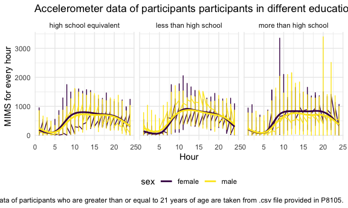
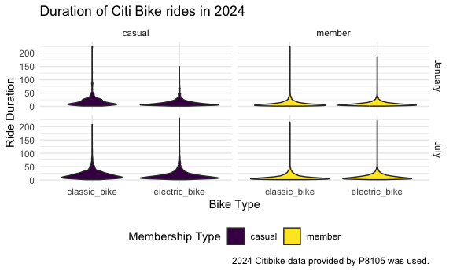
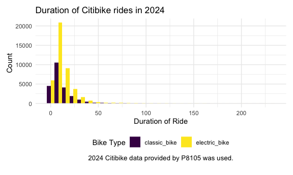
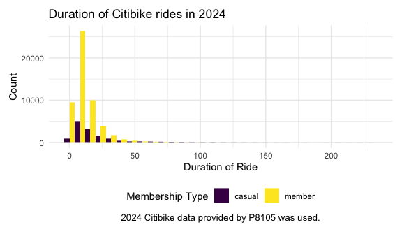

p8105_hw3_sy3269
================
Soomin You

# Problem 1

The packages required for this homework (e.g. `tidyverse` and
`lubridate`) were loaded and settings were applied.

``` r
library(p8105.datasets)
data("ny_noaa") 

ny_noaa |>
  group_by(id) |>
  summarize(n_obs_per_id = n()) |>
  view()

clean_ny_noaa = 
  ny_noaa |> 
  mutate(
    tmax = as.integer(tmax), 
    tmin = as.integer(tmin), 
    tmax = tmax/10, 
    tmin = tmin/10, 
    prcp = prcp/10,     
    year = year(date),
    month = month(date),
    day = day(date)
  ) |>
  arrange(year, month, day) |>
  drop_na()

clean_ny_noaa |>
  group_by(id) |>
  summarize(n_obs_per_id = n()) |>
  view()

clean_ny_noaa |>
  group_by(year) |>
  summarize(n_obs_per_yr = n()) |>
  view()
```

The NY NOAA data was imported and studied.

In the original NOAA data set, there are total of 2,595,176 observations
from 747 different locations, ranging from year 1981 to 2020. Also,
there are 7 different variables as follows: `id` that corresponds to the
location, `date` that shows when the observation data was collected,
`snow` for snowfall amount, `snwd` for snow depth, `tmax` for maximum
temperature and `tmin` for minimum temperature.

Then, the data was cleaned and three additional variables for `year`,
`month`, and `date` were added. Any observation with missing data were
excluded for later analysis.

In addition, some one the variables were mutated so that they have
reasonable units. For instance, to ensure that all data for
precipitation, snowfall and snow depth are given in consistent unit of
mm, `prcp` values given in tenths of mm were adjusted. Similarly, to
ensure the temperature values are given in Celsius, both the `tmax` and
`tmin` values that were given in tenths of Celsius were changed. The
variable types for `tmax` and `tmin` were also changed to integer as
they were originally defined as characters.

The cleaned data was again checked and it was found that with missing
data removed, there were only 1,222,433 observations from 214 locations.

``` r
clean_ny_noaa |>
  drop_na() |>
  count(snow) |>
  filter(n == max(n)) |>
  pull(snow)
```

    ## [1] 0

The most commonly observed value is 0 for snowfall. It probably means
that there are more days that did not snow at all throughout the years,
which sounds reasonable considering that there are four different
seasons in New York.

``` r
clean_ny_noaa |>
  group_by(id, year, month) |>
  summarize(mean_tmax = mean(tmax)) |>
  filter(month == 1 | month == 7) |>
  ggplot(aes(x = year, y = mean_tmax)) + 
  geom_point() + 
  facet_grid(. ~ month) +
  theme(axis.text.x = element_text(angle = 45, vjust = 1, hjust = 1)) +
  labs(
    title = "Average maximum temperature scatterplot",
    x = "Year",
    y = "Average Maximum Temp (C)",
    caption = "Weather data taken from p8105 ny_noaa datasets."
  )
```

    ## `summarise()` has grouped output by 'id', 'year'. You can override using the
    ## `.groups` argument.


A two-panel plot showing the average maximum temperature in January and
July for each station across the years is shown above. The average
maximum temperatures in July seem to be more consistent over the time
compared to the average maximum temperatures in January. There is only
one notable outlier that fall below the overall distribution in July of
late 1980s where are there are several outstanding outliers in both
upper and lower area of the distribution in January plot.

Make a two-panel plot showing (i) tmax vs tmin for the full dataset
(note that a scatterplot may not be the best option); and (ii) make a
plot showing the distribution of snowfall values greater than 0 and less
than 100 separately by year.

# Problem 2

``` r
nhanes_accel_df = 
  read_csv("./nhanes_accel.csv", na = c("NA", ",", "")) |>
  janitor::clean_names()
```

    ## Rows: 250 Columns: 1441
    ## ── Column specification ────────────────────────────────────────────────────────
    ## Delimiter: ","
    ## dbl (1441): SEQN, min1, min2, min3, min4, min5, min6, min7, min8, min9, min1...
    ## 
    ## ℹ Use `spec()` to retrieve the full column specification for this data.
    ## ℹ Specify the column types or set `show_col_types = FALSE` to quiet this message.

``` r
nhanes_demo_df = 
  read_csv("./nhanes_covar.csv", na = c("NA", ".", ""), skip = 4) |>
  janitor::clean_names() |> 
  mutate(
    sex = case_match(
      sex, 
      1 ~ "male", 
      2 ~ "female"), 
    sex = factor(sex),
    education = case_match(
      education, 
      1 ~ "less than high school", 
      2 ~ "high school equivalent", 
      3 ~ "more than high school"),
    education = factor(education)
    ) 
```

    ## Rows: 250 Columns: 5
    ## ── Column specification ────────────────────────────────────────────────────────
    ## Delimiter: ","
    ## dbl (5): SEQN, sex, age, BMI, education
    ## 
    ## ℹ Use `spec()` to retrieve the full column specification for this data.
    ## ℹ Specify the column types or set `show_col_types = FALSE` to quiet this message.

``` r
nhanes_data_df = 
  left_join(nhanes_demo_df, nhanes_accel_df, by = "seqn") |>
  drop_na(age, bmi, education) |>
  filter(age >= 21) 
```

An accelerometer data collected in the NHANES study was loaded and
cleaned. Demographic data of the participants in the NHANES study was
also loaded and cleaned.

Some of the variables in the demographic data were changed to more
self-explanatory values and their types were changed to factor. For
instance, values for `sex` variable was changed from 1 and 2 to male and
female.

In addition, the two data sets were merged into one data frame and
participants who did not have full demographic data were excluded. Also,
only the participants who were 21 years or older were included in the
final data set `nhanes_data_df.`

``` r
nhanes_data_df |>
  group_by(education, sex) |>
  janitor::tabyl(education, sex) |>
  knitr::kable()
```

| education              | female | male |
|:-----------------------|-------:|-----:|
| high school equivalent |     23 |   35 |
| less than high school  |     28 |   27 |
| more than high school  |     59 |   56 |

A reader-friendly table for the number of men and women in each
education category was made.

``` r
nhanes_data_df = 
  nhanes_data_df |>
  pivot_longer(
    cols = min1:min1440,
    names_to = "minute",
    values_to = "mims",
    names_prefix = "min"
  )

nhanes_data_df |>
  group_by(seqn, sex, age, education) |>
  summarize(total_activity = sum(mims, na.rm = TRUE)) |>
  ggplot(aes(x = age, fill = sex)) +
  geom_histogram(position = "dodge") + 
  facet_grid(. ~ education) +
  labs(
    title = "Age distribution of participants in different education levels",
    x = "Age",
    y = "Count",
    caption = "NHANES data of participants who are greater than or equal to 21 years of age are taken from .csv file provided in P8105."
  )
```

    ## `summarise()` has grouped output by 'seqn', 'sex', 'age'. You can override
    ## using the `.groups` argument.
    ## `stat_bin()` using `bins = 30`. Pick better value with `binwidth`.


Prior to creating a graph, the data was reformatted using
`pivot_longer`. Then, `group_by` and `summarize` function was used to
calculate the total_activity that sums up the accelerometer data
measured every minute throughout the day. A visualization of the age
distributions for men and women in each education category was created.

For education level ‘more than high school,’ there are more of the
younger participants who are under 40 than the older participants. The
distribution for both male and female are skewed to the right.

For ‘less than high school’ level, there are greater number of
participants who are over 40. The distribution is left skewed for both
male and female participants.

For ‘high school equivalent’ level, male distribution is bimodal whereas
female distribution is left-skewed.

``` r
nhanes_data_df |>
  group_by(seqn, sex, age, education) |>
  summarize(total_activity = sum(mims, na.rm = TRUE)) |>
  ggplot(aes(x = age, y = total_activity, color = sex)) + 
  geom_point() +
  geom_smooth(se = FALSE) + 
  facet_grid(. ~ education) +
  labs(
    title = "Age distribution of Accelerometer data of participants in different education levels",
    x = "Age",
    y = "Total activity",
    caption = "NHANES data of participants who are greater than or equal to 21 years of age are taken from .csv file provided in P8105."
  )
```

    ## `summarise()` has grouped output by 'seqn', 'sex', 'age'. You can override
    ## using the `.groups` argument.
    ## `geom_smooth()` using method = 'loess' and formula = 'y ~ x'


Overall, the younger the participants are, the higher the total activity
is for both female and male regardless of the education level. The
regression line for both males and females in all three different
education levels have similar tendencies. However, in ‘high school
equivalent’ group, there is a female participant around 30 who has a
relatively low total-activity observation compared to females in her age
and another female participant around the same age with a notably high
observation.

It can be also seen that in ‘high school equivalent’ and ‘more than high
school’ groups, females tend to have higher total activity than males in
all age groups. However, for ‘less than high school’ group, only female
participants who are younger than 40 have higher total activity than
males; for participants over 40, higher total activity observations can
be found in males according to the regression line added with
`geom_smooth`.

``` r
nhanes_data_df |>
  group_by(seqn, hour = rep(1:24, times = 228, each = 60), education, sex) |>
  summarize(mims_hr = sum(mims, na.rm = TRUE), .groups = 'drop') |>
  ggplot(aes(x = hour, y = mims_hr, color = sex)) + 
  geom_point(alpha = 0.5, size = 0.5) + 
  geom_smooth(se = FALSE) + 
  facet_grid(. ~ education) + 
  labs(
    title = "Accelerometer data of participants participants in different education levels over a course of the day", 
    x = "Hour", 
    y = "MIMS for every hour", 
    caption = "NHANES data of participants who are greater than or equal to 21 years of age are taken from .csv file provided in P8105."
  )
```

    ## `geom_smooth()` using method = 'gam' and formula = 'y ~ s(x, bs = "cs")'



# Problem 3

``` r
bike_jan_2020 = 
  read_csv("./citibike/Jan 2020 Citi.csv", na = c("NA", ".", "")) |>
  janitor::clean_names() |>
  mutate(year = 2020, month = "January") 
```

    ## Rows: 12420 Columns: 7
    ## ── Column specification ────────────────────────────────────────────────────────
    ## Delimiter: ","
    ## chr (6): ride_id, rideable_type, weekdays, start_station_name, end_station_n...
    ## dbl (1): duration
    ## 
    ## ℹ Use `spec()` to retrieve the full column specification for this data.
    ## ℹ Specify the column types or set `show_col_types = FALSE` to quiet this message.

``` r
bike_jan_2024 = 
  read_csv("./citibike/Jan 2024 Citi.csv", na = c("NA", ".", "")) |>
  janitor::clean_names() |>
  mutate(year = 2024, month = "January")
```

    ## Rows: 18861 Columns: 7
    ## ── Column specification ────────────────────────────────────────────────────────
    ## Delimiter: ","
    ## chr (6): ride_id, rideable_type, weekdays, start_station_name, end_station_n...
    ## dbl (1): duration
    ## 
    ## ℹ Use `spec()` to retrieve the full column specification for this data.
    ## ℹ Specify the column types or set `show_col_types = FALSE` to quiet this message.

``` r
bike_jul_2020 = 
  read_csv("./citibike/July 2020 Citi.csv", na = c("NA", ".", "")) |>
  janitor::clean_names() |>
  mutate(year = 2020, month = "July")
```

    ## Rows: 21048 Columns: 7
    ## ── Column specification ────────────────────────────────────────────────────────
    ## Delimiter: ","
    ## chr (6): ride_id, rideable_type, weekdays, start_station_name, end_station_n...
    ## dbl (1): duration
    ## 
    ## ℹ Use `spec()` to retrieve the full column specification for this data.
    ## ℹ Specify the column types or set `show_col_types = FALSE` to quiet this message.

``` r
bike_jul_2024 = 
  read_csv("./citibike/July 2024 Citi.csv", na = c("NA", ".", "")) |>
  janitor::clean_names() |>
  mutate(year = 2024, month = "July")
```

    ## Rows: 47156 Columns: 7
    ## ── Column specification ────────────────────────────────────────────────────────
    ## Delimiter: ","
    ## chr (6): ride_id, rideable_type, weekdays, start_station_name, end_station_n...
    ## dbl (1): duration
    ## 
    ## ℹ Use `spec()` to retrieve the full column specification for this data.
    ## ℹ Specify the column types or set `show_col_types = FALSE` to quiet this message.

``` r
bike_data = bind_rows(bike_jan_2020, bike_jan_2024, bike_jul_2020, bike_jul_2024)

bike_data |>
  group_by(member_casual, year, month) |> 
  summarize(n_obs = n()) |>
  pivot_wider(
    names_from = c(month, year),
    values_from = n_obs
  ) |>
  knitr::kable()
```

    ## `summarise()` has grouped output by 'member_casual', 'year'. You can override
    ## using the `.groups` argument.

| member_casual | January_2020 | July_2020 | January_2024 | July_2024 |
|:--------------|-------------:|----------:|-------------:|----------:|
| casual        |          984 |      5637 |         2108 |     10894 |
| member        |        11436 |     15411 |        16753 |     36262 |

NYC Citi Bike data provided was imported and cleaned.

A reader friendly table showing the total number of rides separating
casual riders and Citi Bike members is made for all four combinations:
January 2020, July 2020, January 2024, and July 2024.

In all four combination of year and month, there were notably more
member rides than casual rides. Both member rides increased in 2024
compared to 2020 for both month January and July.

There tends to more rides in July than in January, possibly due to
weather.

``` r
bike_jul_2024 |>
  count(start_station_name) |>
  arrange(desc(n)) |>
  slice(1:5) |>
  knitr::kable()
```

| start_station_name       |   n |
|:-------------------------|----:|
| Pier 61 at Chelsea Piers | 163 |
| University Pl & E 14 St  | 155 |
| W 21 St & 6 Ave          | 152 |
| West St & Chambers St    | 150 |
| W 31 St & 7 Ave          | 146 |

A table showing the 5 most popular starting stations for July 2024 with
the number of rides originating from these stations is made. The most
popular starting station is Pier 61 at Chelsea Piers with 163 rides.

``` r
bike_data |>
  group_by(weekdays, year, month) |>
  summarize(median_duration = median(duration)) |>
  mutate(
    weekdays = 
      factor(weekdays, levels = c("Monday", "Tuesday", "Wednesday", "Thursday", "Friday", "Saturday", "Sunday"))) |>
  ggplot(aes(x = weekdays, y = median_duration, fill = factor(year))) +
  geom_col(position = "dodge") + 
  facet_grid(. ~ month) + 
  labs(
    x = "Weekdays",
    y = "Median duration of ride",
    title = "Duration of Citibike rides in January and July",
    fill = "Year",
    caption = "Citibike data provided by P8105 was used."
  ) +  
  theme(axis.text.x = element_text(angle = 45, hjust = 1))
```

    ## `summarise()` has grouped output by 'weekdays', 'year'. You can override using
    ## the `.groups` argument.


A plot showing the median duration of ride for every day of the week is
shown for the month of January and July, comparing 2020 and 2024 data
sets. It can be seen that for both January and July, the overall median
duration of ride decreased in 2024, compared to in 2020. The decrease in
July is especially notable compared to the one in January.

The longest median duration can be seen in July 2020 data, especially
during the weekends. However, the median duration of rides is not
significantly greater in the weekends for 2024 data.

``` r
bike_2024_month = 
  bike_data |>
  filter(year == 2024) |>
  group_by(duration, month, member_casual, rideable_type) |>
  ggplot(aes(x = duration, fill = month)) + 
  geom_histogram(position = "dodge") +
  labs(
    x = "Duration of Ride",
    y = "Count",
    title = "Duration of Citibike rides in 2024",
    color = "Month",
    caption = "2024 Citibike data provided by P8105 was used.") +
   theme(plot.caption = element_text(size = 10, hjust = 0.5),
        plot.margin = margin(t = 10, b = 20, l = 10, r = 10)) 

bike_2024_bike = 
  bike_data |>
  filter(year == 2024) |>
  group_by(duration, month, member_casual, rideable_type) |>
  ggplot(aes(x = duration, fill = rideable_type)) + 
  geom_histogram(position = "dodge") +
  labs(
    x = "Duration of Ride",
    y = "Count",
    title = "Duration of Citibike rides in 2024",
    fill = "Bike Type",
    caption = "2024 Citibike data provided by P8105 was used.") +
  theme(plot.caption = element_text(size = 10, hjust = 0.5),
        plot.margin = margin(t = 10, b = 20, l = 10, r = 10)) 

bike_2024_member = 
  bike_data |>
  filter(year == 2024) |>
  group_by(duration, month, member_casual, rideable_type) |>
  ggplot(aes(x = duration, fill = member_casual)) + 
  geom_histogram(position = "dodge") +
  labs(
    x = "Duration of Ride",
    y = "Count",
    title = "Duration of Citibike rides in 2024",
    fill = "Membership Type",
    caption = "2024 Citibike data provided by P8105 was used.") +
   theme(plot.caption = element_text(size = 10, hjust = 0.5),
        plot.margin = margin(t = 10, b = 20, l = 10, r = 10)) 

bike_2024_month
```

    ## `stat_bin()` using `bins = 30`. Pick better value with `binwidth`.



``` r
bike_2024_bike
```

    ## `stat_bin()` using `bins = 30`. Pick better value with `binwidth`.



``` r
bike_2024_member
```

    ## `stat_bin()` using `bins = 30`. Pick better value with `binwidth`.



A figure that shows the median duration of ride for membership type per
the bike type is drawn for January and July 2024 data.

For data in 2024, There were relatively few electric Citi Bikes in 2020,
but many more are available now.

For data in 2024, make a figure that shows the impact of month,
membership status, and bike type on the distribution of ride duration.
Comment on your results.
