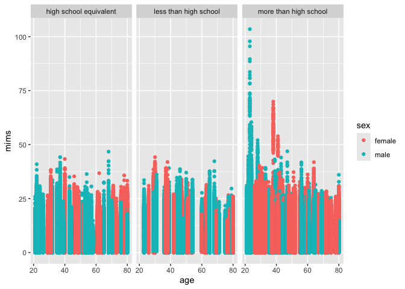

p8105_hw3_sy3269
================
Soomin

# Problem 1

The packages required for this homework were

``` r
library(p8105.datasets)
data("ny_noaa") 

ny_noaa |>
  group_by(id) |>
  arrange(date) |>
  summarize(n_obs = n())
```

    ## # A tibble: 747 × 2
    ##    id          n_obs
    ##    <chr>       <int>
    ##  1 US1NYAB0001  1157
    ##  2 US1NYAB0006   852
    ##  3 US1NYAB0010   822
    ##  4 US1NYAB0016   214
    ##  5 US1NYAB0017   459
    ##  6 US1NYAB0021   365
    ##  7 US1NYAB0022   273
    ##  8 US1NYAB0023   365
    ##  9 US1NYAB0025   215
    ## 10 US1NYAL0002   549
    ## # ℹ 737 more rows

The NY NOAA data is imported and studied. There are total of 2595176
observations from 747 different locations in this data set, and there
are 7 different variables. The variables are `id` that corresponds to
location, `date` that shows when the observation data was collected,
`snow`, `snwd`, `tmax` and `tmin`. The NY NOAA data ranges from 1981 to
2020. Depending on the id, the number of available observations differ.
It can be seen that there are a lot missing data in this data set. For
instance, there are 1157 observations for id `US1NYAB0001`, whereas
there are only 214 observations available for id `US1NYAB0016` for the
same period of time.

``` r
ny_noaa_df = 
  ny_noaa |> 
  group_by(id) |>
  mutate(
    year = year(date), 
    month = month(date), 
    day = day(date)
  ) |>
  arrange(year, month, day) |>
  mutate(
    tmax = as.integer(tmax), 
    tmin = as.integer(tmin)
  )

ny_noaa_df |>
  drop_na()
```

    ## # A tibble: 1,222,433 × 10
    ## # Groups:   id [214]
    ##    id          date        prcp  snow  snwd  tmax  tmin  year month   day
    ##    <chr>       <date>     <int> <int> <int> <int> <int> <dbl> <dbl> <int>
    ##  1 USC00300055 1981-01-01     0     0    76   -50  -128  1981     1     1
    ##  2 USC00300085 1981-01-01     3     3   102   -44  -139  1981     1     1
    ##  3 USC00300183 1981-01-01     0     0    76   -33  -117  1981     1     1
    ##  4 USC00300220 1981-01-01     0     0   203   -39  -122  1981     1     1
    ##  5 USC00300331 1981-01-01     0     0    51   -72  -144  1981     1     1
    ##  6 USC00300505 1981-01-01     0     0   229   -44  -156  1981     1     1
    ##  7 USC00300766 1981-01-01     0     0    76   -39  -139  1981     1     1
    ##  8 USC00300785 1981-01-01     0     0   432  -117  -228  1981     1     1
    ##  9 USC00300889 1981-01-01     0     0     0   -17   -83  1981     1     1
    ## 10 USC00300937 1981-01-01     0     0   152   -39  -144  1981     1     1
    ## # ℹ 1,222,423 more rows

The imported NY NOAA data was cleaned and separate variables for year,
month, and day were created. The variable units for temperature,
precipitation and snowfall data were checked and it was noticed that the
temperature data is weird. We cannot have -223 degrees Fahrenheit,
Celsius or Kelvin.

## Ensure observations for temperature, precipitation, and snowfall are given in reasonable units.

Also, the variable types for `tmax` and `tmin` were changed to integer
as they were originally defined as characters.

For snowfall, what are the most commonly observed values? Why?

``` r
ny_noaa_df |>
  filter(month == 1 | month == 7) |>
  mutate(avg_tmax = mean(tmax)) |>
  drop_na() |>
  ggplot(aes(x = year, y = avg_tmax, color = id)) + 
  geom_point() +
  facet_grid(. ~ month) +
  labs(
    title = "Average maximum temperature scatterplot",
    x = "Year",
    y = "Average Maximum Temp (C)",
    color = "Location",
    caption = "Weather data taken from p8105 ny_noaa datasets."
    )
```

<!-- -->

Make a two-panel plot showing the average max temperature in January and
in July in each station across years. Is there any observable /
interpretable structure? Any outliers?

Make a two-panel plot showing (i) tmax vs tmin for the full dataset
(note that a scatterplot may not be the best option); and (ii) make a
plot showing the distribution of snowfall values greater than 0 and less
than 100 separately by year.

# Problem 2

``` r
nhanes_accel_df = 
  read_csv("./nhanes_accel.csv", na = c("NA", ",", "")) |>
  janitor::clean_names()
```

    ## Rows: 250 Columns: 1441
    ## ── Column specification ────────────────────────────────────────────────────────
    ## Delimiter: ","
    ## dbl (1441): SEQN, min1, min2, min3, min4, min5, min6, min7, min8, min9, min1...
    ## 
    ## ℹ Use `spec()` to retrieve the full column specification for this data.
    ## ℹ Specify the column types or set `show_col_types = FALSE` to quiet this message.

``` r
nhanes_demo_df = 
  read_csv("./nhanes_covar.csv", na = c("NA", ".", ""), skip = 4) |>
  janitor::clean_names() |> 
  mutate(
    sex = case_match(
      sex, 
      1 ~ "male", 
      2 ~ "female"), 
    sex = factor(sex),
    education = case_match(
      education, 
      1 ~ "less than high school", 
      2 ~ "high school equivalent", 
      3 ~ "more than high school"),
    education = factor(education)
    ) 
```

    ## Rows: 250 Columns: 5
    ## ── Column specification ────────────────────────────────────────────────────────
    ## Delimiter: ","
    ## dbl (5): SEQN, sex, age, BMI, education
    ## 
    ## ℹ Use `spec()` to retrieve the full column specification for this data.
    ## ℹ Specify the column types or set `show_col_types = FALSE` to quiet this message.

``` r
nhanes_study_df = 
  left_join(nhanes_demo_df, nhanes_accel_df, by = "seqn") |>
  drop_na() |>
  filter(age >= 21)
```

An accelerometer data collected in the NHANES study was loaded and
cleaned. Demographic data of the participants in the NHANES study was
also loaded and cleaned. Some of the variables in the demographic data
were changed to more self-explanatory value and the type was set as
factor. The two data sets were merged into one data frame and
participants who did not have full demographic data were excluded and
only the participants who were 21 years or older were included.

``` r
nhanes_study_df |>
  group_by(education, sex) |>
  janitor::tabyl(education, sex) |>
  knitr::kable()
```

| education              | female | male |
|:-----------------------|-------:|-----:|
| high school equivalent |     23 |   35 |
| less than high school  |     28 |   27 |
| more than high school  |     59 |   56 |

A reader-friendly table for the number of men and women in each
education category was made.

``` r
nhanes_study_df |>
  group_by(sex, education) |>
  pivot_longer(
    cols = min1:min1440, 
    names_to = "minute",
    values_to = "mims", 
  ) |>
  ggplot(aes(x = age, y = mims, color = sex)) + 
  geom_point() +
  facet_grid(. ~ education)
```

<!-- -->

## Produce a reader-friendly table for the number of men and women in each education category, and create a visualization of the age distributions for men and women in each education category. Comment on these items.

# Problem 3

``` r
bike_jan_2020 = 
  read_csv("./citibike/Jan 2020 Citi.csv", na = c("NA", ".", "")) |>
  janitor::clean_names()
```

    ## Rows: 12420 Columns: 7
    ## ── Column specification ────────────────────────────────────────────────────────
    ## Delimiter: ","
    ## chr (6): ride_id, rideable_type, weekdays, start_station_name, end_station_n...
    ## dbl (1): duration
    ## 
    ## ℹ Use `spec()` to retrieve the full column specification for this data.
    ## ℹ Specify the column types or set `show_col_types = FALSE` to quiet this message.

``` r
bike_jan_2020 |>
  group_by(member_casual) |>
  summarize(n_obs = n()) |>
  knitr::kable()
```

| member_casual | n_obs |
|:--------------|------:|
| casual        |   984 |
| member        | 11436 |

``` r
bike_jan_2024 = 
  read_csv("./citibike/Jan 2024 Citi.csv", na = c("NA", ".", "")) |>
  janitor::clean_names()
```

    ## Rows: 18861 Columns: 7
    ## ── Column specification ────────────────────────────────────────────────────────
    ## Delimiter: ","
    ## chr (6): ride_id, rideable_type, weekdays, start_station_name, end_station_n...
    ## dbl (1): duration
    ## 
    ## ℹ Use `spec()` to retrieve the full column specification for this data.
    ## ℹ Specify the column types or set `show_col_types = FALSE` to quiet this message.

``` r
bike_jan_2024 |>
  group_by(member_casual) |>
  summarize(n_obs = n()) |>
  knitr::kable()
```

| member_casual | n_obs |
|:--------------|------:|
| casual        |  2108 |
| member        | 16753 |

``` r
bike_july_2020 = 
  read_csv("./citibike/July 2020 Citi.csv", na = c("NA", ".", "")) |>
  janitor::clean_names() 
```

    ## Rows: 21048 Columns: 7
    ## ── Column specification ────────────────────────────────────────────────────────
    ## Delimiter: ","
    ## chr (6): ride_id, rideable_type, weekdays, start_station_name, end_station_n...
    ## dbl (1): duration
    ## 
    ## ℹ Use `spec()` to retrieve the full column specification for this data.
    ## ℹ Specify the column types or set `show_col_types = FALSE` to quiet this message.

``` r
bike_july_2020 |>
  group_by(member_casual) |>
  summarize(n_obs = n()) |>
  knitr::kable()
```

| member_casual | n_obs |
|:--------------|------:|
| casual        |  5637 |
| member        | 15411 |

``` r
bike_july_2024 = 
  read_csv("./citibike/July 2024 Citi.csv", na = c("NA", ".", "")) |>
  janitor::clean_names() 
```

    ## Rows: 47156 Columns: 7
    ## ── Column specification ────────────────────────────────────────────────────────
    ## Delimiter: ","
    ## chr (6): ride_id, rideable_type, weekdays, start_station_name, end_station_n...
    ## dbl (1): duration
    ## 
    ## ℹ Use `spec()` to retrieve the full column specification for this data.
    ## ℹ Specify the column types or set `show_col_types = FALSE` to quiet this message.

``` r
bike_july_2024 |> 
  group_by(member_casual) |>
  summarize(n_obs = n()) |>
  knitr::kable()
```

| member_casual | n_obs |
|:--------------|------:|
| casual        | 10894 |
| member        | 36262 |

NYC Citi Bike data provided was imported and cleaned. Then, a
reader-friendly table showing the total number of rides separating
casual riders and Citi Bike members is made for each combination of year
and month. For January 2020, there were 984 casual rides and 11436
member rides. For July 2020, there were 2108 casual rides and 16753
member rides. For January 2024, there were 5637 casual rides and 15411
member rides. For July 2024, there were 10894 casual rides and 36262
member rides.

In all four combination of year and month, there were notably more
member rides than casual rides.

``` r
bike_july_2024 |>
  count(start_station_name) |>
  arrange(desc(n)) |>
  slice(1:5) |>
  knitr::kable()
```

| start_station_name       |   n |
|:-------------------------|----:|
| Pier 61 at Chelsea Piers | 163 |
| University Pl & E 14 St  | 155 |
| W 21 St & 6 Ave          | 152 |
| West St & Chambers St    | 150 |
| W 31 St & 7 Ave          | 146 |

A table showing the 5 most popular starting stations for July 2024 with
the number of rides originating from these stations is made.
